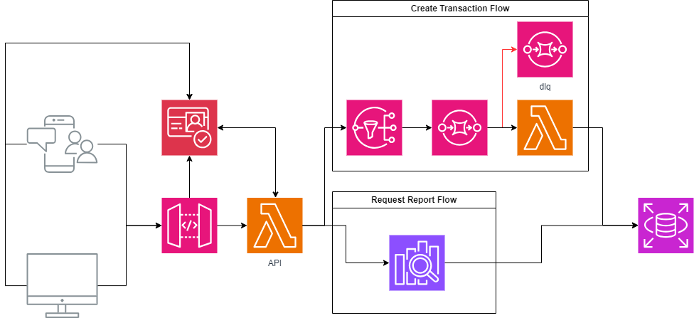
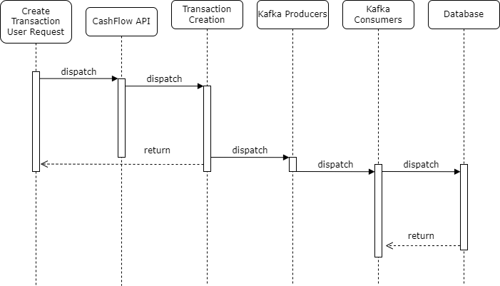

# Cashflow Management System

## Overview

Para a solução ser resiliente foi adotada uma arquitetura assíncrona, onde o serviço de transações e o serviço de consolidação são independentes e se comunicam através de um barramento de eventos.
O serviço de transações é responsável por processar as entradas de débito e crédito diárias, enquanto o serviço de consolidação gera relatórios de saldo consolidado diariamente.
Para garantir uma alta disponibilidade, o sistema foi projetado usando modelo de eventos, onde as mensagens são armazenadas em um barramento de eventos (Kafka) e processadas de forma assíncrona.
Dessa forma o suário não precisa esperar a consolidação ser finalizada para realizar novas transações e permite que o sistema seja escalável.
Outra vantagem é que o sistema é tolerante a falhas, caso o serviço de consolidação fique indisponível, as mensagens serão processadas assim que o serviço estiver disponível novamente.
Caso aconteça uma falha no serviço de processamento de transações, essas são armazendas em uma fila de mensagens e para serem analisadas e reprocesadas posteriormente.
A arquitetura por mensagens também permite que o sistema seja facilmente integrado com outros sistemas, como um sistema de análise de dados ou um sistema de notificação.
Para segurança, o sistema utiliza de um serviço externo de autenticação e autorização.
Essa autentificação é realizada no serviço de API Gateway, que é responsável por rotear as requisições para os serviços corretos, garantindo que apenas usuários autenticados possam acessar os serviços e que não haja necessidade de repetir a lógica de autenticação em cada serviço.


]

### Features

- **Transaction Service**: Manages daily debit and credit entries.
- **Report Service**: Provides daily consolidated balance reporting.

---

## Diagrama de Requisição

Abaixo está o diagrama de requisição do sistema, onde é possível ver a interação entre os serviços e o barramento de eventos.
A requisição realizada pelo usuário faz um processamento rapido pois não requer esperar consolidações e nem respostas de outros components arquiteurais.
Com isso a resiliencia do sistema é garantido, pois dificulta um gargalo de requisições.
Caso aconteca um gargalo de requisições, o sistema é facilmente escalável, pois é possivel adicionar mais instancias.
Se o problema descer para a camada de processamento de transações, as mensagens são armazenadas em uma fila de mensagens e processadas posteriormente.




## Componentes (POC)

- **API Asp Core 8**
- **Asp Core 8 Console App**
- **MSSQLServer**
- **Kafka Broker**
- **Kafka Zookeeper**


### Requirements

- **Docker** (for containerized deployment)
  
## Installation

1. **Clone the repository**:
   ```bash
   git clone https://github.com/DMPatod/act-cashflow.git
   cd act-cashflow
   ```

2. **Publish Docker Container**:
   ```bash
   docker-compose up
   ```


### API Endpoints

- **Transaction Service**:
  - `POST /api/transactions` - Create a new transaction (debit/credit).
  - `GET /api/transactions/{id}` - Get transaction details by ID. [TODO]
  
- **Report Service**:
  - `GET /api/reports/{date}` - Get the consolidated balance for the day. [TODO]

## Future Improvements

The current solution is designed to be scalable and resilient, but there are a few areas for future enhancements:

1. **Monitoring**: Add monitoring and alerting features using tools like **Prometheus** and **Grafana** for better observability and troubleshooting.
2. **Enhanced Security**: Add Auth Container
3. **Improved Resilience**: Integrate Polly for advanced retry policies, circuit breakers, and bulkhead isolation patterns.

---
